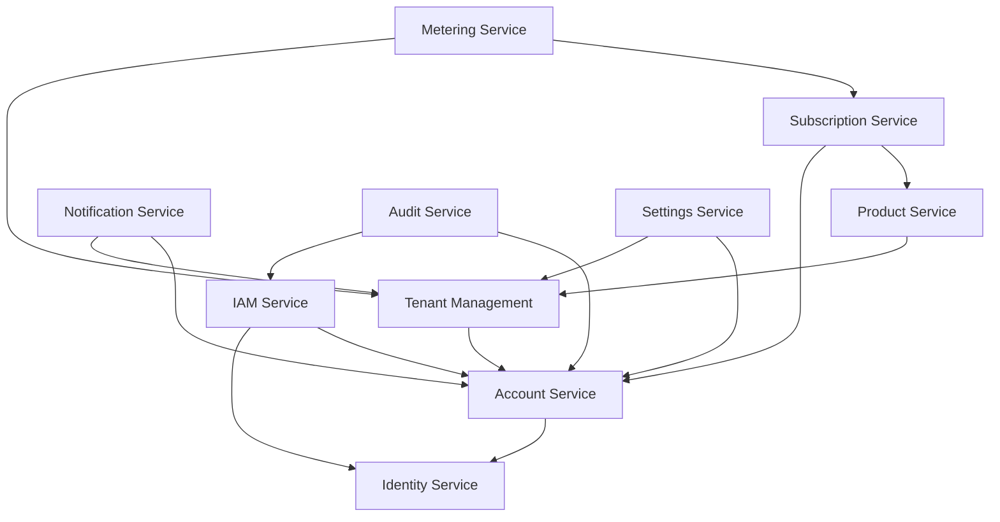

# FlowMind Technologies - Core Services Documentation

> **Version**: 1.0  
> **Last Updated**: November 2025  
> **Status**: Technical Specification

---

## 📚 Service Catalog

This directory contains detailed requirements and technical specifications for all FlowMind platform core services.

### Core Platform Services

| # | Service | Document | Priority | Status |
|---|---------|----------|----------|--------|
| 1 | [Account Service](./01-account-service.md) | Organization & Account Management | P0 | Draft |
| 2 | [Identity Service](./02-identity-service.md) | Authentication (Keycloak) | P0 | Draft |
| 3 | [IAM Service](./03-iam-service.md) | Authorization & Access Control | P0 | Draft |
| 4 | [Tenant Management Service](./04-tenant-management-service.md) | Multi-tenancy Configuration | P0 | Draft |
| 5 | [Settings Service](./05-settings-service.md) | Configuration Management | P1 | Draft |

### Business Support Services

| # | Service | Document | Priority | Status |
|---|---------|----------|----------|--------|
| 6 | [Product & Feature Service](./06-product-feature-service.md) | Product Catalog & Entitlements | P0 | Draft |
| 7 | [Subscription & Billing Service](./07-subscription-billing-service.md) | Subscription Lifecycle & Payments | P0 | Draft |
| 8 | [Metering & Usage Service](./08-metering-usage-service.md) | Usage Tracking & Quotas | P1 | Draft |
| 9 | [Customer Support Service](./09-customer-support-service.md) | Ticketing & Knowledge Base | P2 | Draft |

### Infrastructure Services

| # | Service | Document | Priority | Status |
|---|---------|----------|----------|--------|
| 10 | [API Gateway](./10-api-gateway.md) | Request Routing & Rate Limiting | P0 | Draft |
| 11 | [Notification Service](./11-notification-service.md) | Multi-channel Communications | P0 | Draft |
| 12 | [Audit & Logging Service](./12-audit-logging-service.md) | Compliance & Activity Logs | P0 | Draft |
| 13 | [Feature Flags Service](./13-feature-flags-service.md) | Feature Toggles & Rollouts | P1 | Draft |
| 14 | [Analytics & Telemetry Service](./14-analytics-telemetry-service.md) | Product Analytics | P1 | Draft |
| 15 | [File & Asset Service](./15-file-asset-service.md) | File Storage & CDN | P1 | Draft |

---

## 🏗️ Architecture Overview

```
┌─────────────────────────────────────────────────────────────────────────────┐
│                            API GATEWAY (10)                                  │
│                    Authentication • Rate Limiting • Routing                  │
└─────────────────────────────────────────────────────────────────────────────┘
                                      │
        ┌─────────────────────────────┼─────────────────────────────┐
        ▼                             ▼                             ▼
┌───────────────────┐     ┌───────────────────┐     ┌───────────────────┐
│  CORE PLATFORM    │     │ BUSINESS SUPPORT  │     │  INFRASTRUCTURE   │
├───────────────────┤     ├───────────────────┤     ├───────────────────┤
│ 1. Account        │     │ 6. Product        │     │ 11. Notification  │
│ 2. Identity       │     │ 7. Subscription   │     │ 12. Audit         │
│ 3. IAM            │     │ 8. Metering       │     │ 13. Feature Flags │
│ 4. Tenant Mgmt    │     │ 9. Support        │     │ 14. Analytics     │
│ 5. Settings       │     │                   │     │ 15. File/Asset    │
└───────────────────┘     └───────────────────┘     └───────────────────┘
        │                             │                             │
        └─────────────────────────────┼─────────────────────────────┘
                                      ▼
┌─────────────────────────────────────────────────────────────────────────────┐
│                           EVENT BUS (RabbitMQ/Kafka)                         │
│                         Async Communication • Event Sourcing                 │
└─────────────────────────────────────────────────────────────────────────────┘
```

---

## 📋 Document Structure

Each service document follows this structure:

```
1. Overview
   - Purpose & Scope
   - Key Features
   - Dependencies

2. Requirements
   - Functional Requirements
   - Non-Functional Requirements
   - Business Rules

3. Technical Specification
   - Data Model (ERD + Table Definitions)
   - API Contracts (OpenAPI format)
   - Events (Published & Consumed)
   - Integration Points

4. Security Considerations
5. Deployment Notes
```

---

## 🔗 Service Dependencies



---

## 🛠️ Technology Stack

| Component | Technology | Notes |
|-----------|------------|-------|
| Runtime | Node.js 20+ / .NET 8 | Service choice |
| Framework | NestJS / ASP.NET Core | Structured, enterprise-ready |
| Database | PostgreSQL 15+ | Primary data store |
| Cache | Redis 7+ | Session, caching |
| Message Broker | RabbitMQ / Kafka | Event-driven |
| Search | Meilisearch / Elasticsearch | Full-text search |
| API Docs | OpenAPI 3.1 | Contract-first |

---

## 📞 Contact

**Platform Team**: platform@flowmind.io

---

*FlowMind Technologies © 2025*
